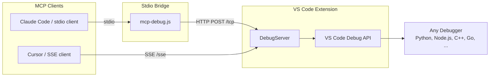

#  VSCode Debug MCP

[](https://github.com/PeakBI/vscode-debug-mcp/actions/workflows/ci.yml)
[](https://codecov.io/gh/PeakBI/vscode-debug-mcp)


Enable an MCP Client to interactively debug code with breakpoints, expression evaluation, and program launching.

This is an [MCP](https://docs.anthropic.com/en/docs/build-with-claude/mcp) server and VS Code extension that exposes debugging capabilities via the Model Context Protocol. It's language-agnostic — it works with any debugger that has a valid `launch.json` in VS Code.

## Tools

| Tool | Actions | Description |
|------|---------|-------------|
| `debug_execute` | launch, stop, continue, stepOver, stepIn, stepOut | Control program execution during debugging |
| `debug_breakpoints` | set, remove, list | Manage breakpoints with support for conditions, hit counts, and log messages |
| `debug_inspect` | evaluate, stackTrace | Inspect program state while paused at a breakpoint |

## Getting Started

1. Download the extension from [releases](https://github.com/PeakBI/vscode-debug-mcp/releases/)
2. Install the extension
   - If using `.vsix` directly, go to the three dots in "Extensions" in VS Code and choose "Install from VSIX..."
3. Once installed, you'll see an "MCP Debug Server" panel in the Debug tab showing the server status, stdio path, and SSE address.


### Claude Code

4. Copy the ready-to-paste setup command using the "Copy Claude Code Setup Command" button in the Debug tab's MCP Debug Server panel, or via the VS Code command palette ("VSCode Debug MCP: Copy Claude Code Setup Command").
5. Paste and run it in your terminal:

```bash
claude mcp add --transport stdio vscode-debug -- node /path/to/mcp-debug.js
```

Or add it to your project's `.mcp.json`:

```json
{
  "mcpServers": {
    "vscode-debug": {
      "command": "node",
      "args": ["/path/to/mcp-debug.js"]
    }
  }
}
```

### GitHub Copilot

4. Copy the stdio server path to your clipboard using the VS Code command "Copy MCP Debug Server stdio path to clipboard"
5. Open the VS Code command palette and run "MCP: Open Workspace Folder Configuration" to edit `.vscode/mcp.json`, then add:

```json
{
  "servers": {
    "vscode-debug": {
      "type": "stdio",
      "command": "node",
      "args": ["/path/to/mcp-debug.js"]
    }
  }
}
```

## Configuration

- `mcpDebug.port` — Server port (default: `4711`)
- `mcpDebug.autostart` — Automatically start the server on activation (default: `true`)

When multiple VS Code windows are open, the extension handles graceful hand-off of the MCP server between windows.

## Architecture



The extension provides two ways for MCP clients to connect:

- **Stdio** — A standalone Node.js bridge process (`mcp-debug.js`) receives MCP requests over stdio and forwards them via HTTP to the extension's debug server. Used by Claude Code and other stdio-based clients.
- **SSE** — Clients connect directly to the extension's SSE endpoint. Used by Cursor and other SSE-capable clients.

Both paths use the VS Code Debug API under the hood, which means the extension works with any language/debugger that supports `launch.json` configurations (Python, Node.js, C++, Go, etc.).

## Developing

1. Clone and open this repo in VS Code
2. Install dependencies: `npm install && cd mcp && npm install && cd ..`
3. Build: `npm run compile`
4. Press F5 to launch the extension in a new VS Code window
5. Rebuild after changes: `npm run compile`

## Packaging

```bash
vsce package
```

## Release Process

This project uses [conventional commits](https://www.conventionalcommits.org/) and [release-please](https://github.com/googleapis/release-please) for automated versioning and releases.

### Commit Messages

All commits should follow the conventional commits format:

- `fix:` — Bug fixes (patch version bump)
- `feat:` — New features (minor version bump)
- `feat!:` / `fix!:` / `refactor!:` — Breaking changes (major version bump)
- `chore:`, `docs:`, `refactor:`, `test:` — No version bump

### PR Testing

Every pull request automatically builds a `.vsix` artifact via CI. Download it from the GitHub Actions "Artifacts" section on the PR's checks to install and test the extension locally before merging.

### Releasing

When conventional commits are pushed to `main`, release-please automatically opens (or updates) a Release PR with a version bump and changelog entry. Merging that PR creates a GitHub release and builds the final `.vsix`, which is uploaded to the release assets.

## Acknowledgements

This project is a fork of [Claude Debugs For You](https://github.com/jasonjmcghee/claude-debugs-for-you) by [Jason McGhee](https://github.com/jasonjmcghee). Thank you for creating the original extension and MCP server that this project builds upon.
